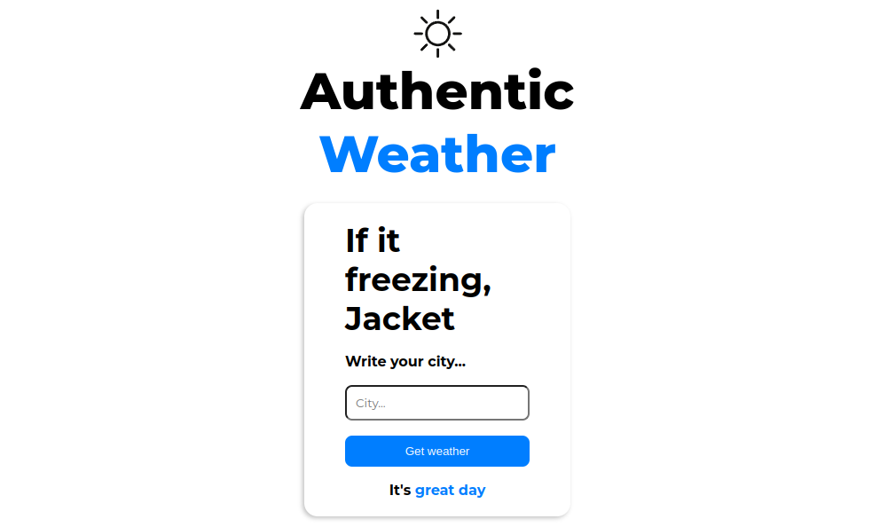
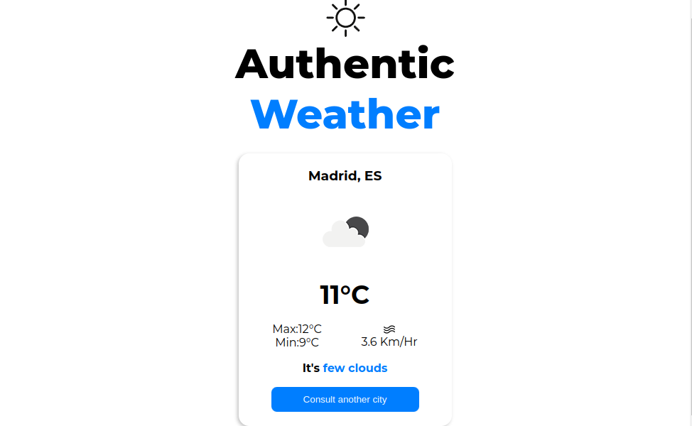
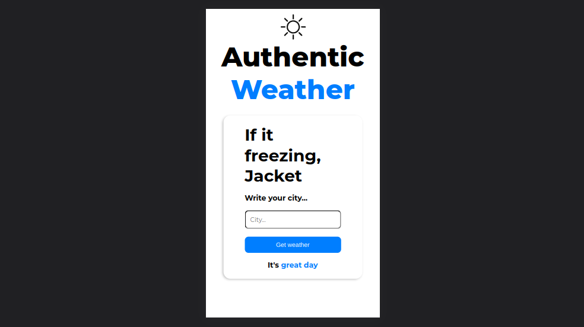

# Consulta del clima

  <h1>👽 LarnU proyecto JS</h1>
  <strong>Documentación del proyecto y marcos de trabajo que se utilizan</strong> 
  <strong>Construido para comunidad de LarnU como entregable</strong>

 

## Que es el panel frontal de devs de larnU?

Es un consulta sencilla a la api : openweathermap.org
para buscar el clima por ciudad.
 

### 🏗 Equipo de Ingeniería  

- [@T0ny-dev](https://github.com/T0ny-dev)

### 👨‍💻 Listados de marcos de trabajo

* HTML
* CSS
* JavasScript 
* Libreria Axios

### 🗎 descargar de proyecto 

* para descargar `git clone`
* Ejecutar en su navegador 

### 🗎 Deploy 

- [GitHub Pages](https://t0ny-dev.github.io/api_weather_js/)

### 🗎 Capturas del proyecto

